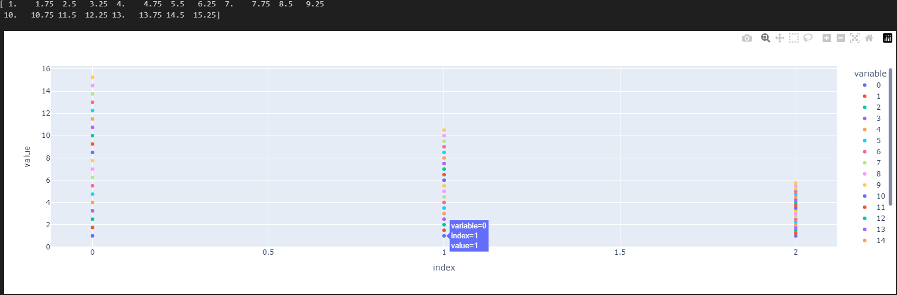
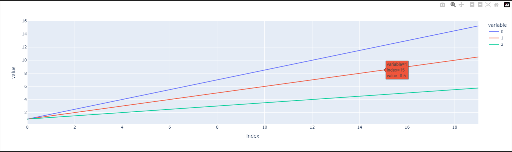

# Python
Aqui é um Guia rápido com as funções e metodos do NumPy e Pandas.

## Diferença de Lista do Python e Array do NumPy

```python
import pandas as pd
import numpy as np

num_elementos = 100

# Lista de Elementos utilizando o Python

#lista_elementos = []
#for x in range (num_elementos):
#lista_elementos.append(x)
#print(lista_elementos[-1])

#Lista de Elementos utilizando o Array do NumPy
array_elementos = np.arange(num_elementos)
print(array_elementos[-1])
```

# # Criação de Array no NumPy
```python
import numpy as np

array_teste = np.array([1, 2, 3, 4, 5, 6, 7, 8, 9, 10])

print(f"Criação de Array no NumPy utilizando o metodo .array:\n{array_teste}\n") # mostra o conteúdo dentro do array_teste.
print(f"Criação de Array no NumPy utilizando o metodo .ones:\n{np.ones([20])}\n") # Cria uma quantidade determinada de numeros 1, a quantidade é definida dentro do [].
print(f"Criação de Array no NumPy utilizando o metodo .zeros:\n{np.zeros([20])}\n") # Cria uma quantidade determinada de numeros 0, a quantidade é definida dentro do [].
print(f"Criação de Array no NumPy utilizando o metodo .Empty:\n{np.empty([15])}\n") # Cria um novo Array sem inicializar seus valores, o conteudo da array sera um bloco de memoria não inicializado.
print(f"Criação de Array no NumPy utilizando o metodo .arange:\n{np.arange(20)}\n") # Cria um Array contendo uma sequencia de valores, que retorna uma array em vez de uma lista.
print(f"Criação de Array no NumPy utilizando o metodo .Linspace:\n{np.linspace(0, 40, num = 41)}\n") #Cria uma Array determinando o inicio de o fim, e também espaçamentos.
```

# # NumPy: A importancia de Definir o tipo de dados
```python
import numpy as np

num_elementos = 1000000000

array_perfomance = np.zeros(num_elementos, dtype = np.int8)
#dtype é um parametro que define o tipo  de dados dos elementos que estão dentro da Array
#int8 significa que os elementos deste array criado será um inteiro de 8bits, variando entre (-128 a 127)
# Isto define e ajuda a velocidade que o codigo vai ser executado.
```

# # Criação de numeros Randomicos
```python
import numpy as np

rng = np.random.default_rng() # Cria uma instância no gerador de numeros aleatorios
print(rng.random(10)) # Gera e imprime os numeros aleatorios, no caso sera gerado 10 numeros de ponto flutuante, sempre que o codigo for executado.


#Para iniciar a aleatoriedade a partir de um numero especifido:

array_aleatorio = rng.uniform(2, 15, 3) # Vai ser gerado um Array aleatorio a partir de um numero espeficido.
print(array_aleatorio)

# 2 = O Menor numero que o array pode chegar.
# 15 = O Maior numero que o Array pode chegar.
# 3 = A Quantidade de numeros aleatorio que vão ser gerado.

```
# # Listar Nomes de forma aleatoria de um Array
```python
import numpy as np

array_nomes = np.array(["Guilherme", "Célia", "Cecilia", "Leticia", "Noah", "Tesla"]) # Array criado e ja recebendo os nomes, que vão ser sorteados.

rng = np.random.default_rng() # Cria uma instância no gerador de numeros aleatorios.

#Selecionar de forma aleatorio um dos nomes do Array.

indice_aleatorio = rng.integers(low=0, high=len(array_nomes), size=3) # O Array indice_aleatorio esta recebendo a função integers, que gera uma array contendo numeros inteiros aleatorios em um intervalo especifico.
nomes_aleatorios = array_nomes[indice_aleatorio] # nomes_aleatorios esta recebendo os dados do array_nomes de forma aleatorios pelo indice_aleatorio.
print(nomes_aleatorios)

# Low = e o indice dos intervalos, neste caso, inicia no 0.
# hight=Len = esta definindo o tamanho do array, neste caso o tamanho e a quantidade de item que esta dentro do array "Array_nomes".
#size = é a quantidade de nomes que sera sorteado dos nomes armazenados na array " Array_nomes".
```

# # Diferenças entre vetor, Matrizes e Tensor
```python
import numpy as np

rng = np.random.default_rng(2) # Cria uma instância para gerar numeros aleatorios.

vetor = rng.random(1) # Cria um objeto de um vetor, que vai armazenar 1 numero aleatorio em 1 dimensão.

print(f"Array de 1 dimensão randômico:\n{vetor}\n")

matriz = rng.random([2,2]) # Cria um objeto de matriz, que vai armazenar numeros aleatorios em 2 dimensões.

print(f"Array de 2 dimensão randômico:\n{matriz}\n")

tensor = rng.random([3, 3, 3]) # Cria um objeto de Tensor, que vai armazenar numeros aleatorios em 3 dimensões ou mais.

print(f"Array de 3 dimensão randômico:\n{tensor}\n")
```

# # Manipulação de Array

```python
import numpy as np

# Array 1 dimensao sem e com.

rng = np.random.default_rng() # Cria um gerador de números aleatorios.

array_1 = rng.random([5,5]) # Gera um Array 2D de dimensão 5x5, preenchendo numeros aleatorio de 0 e 1.
print(f"Array 1 Sem ordenação:\n{array_1}\n") # Exibe o Array gerado
print(f"Array 1 com ordenação:\n{np.sort(array_1, axis = 1)}\n") # Ordena cada linha do Array individualmente e depois imprime o Array.

# Axis = 1 = Se refere as colunas, ou seja as operaçaõ serão realizada entre as linhas de forma individual.
# Axis = 0 = Se refere as linhas, ou seja as operações serão realizadas entre as colunas de forma individual.
# np.sort = é usado para ordenar o Array

# Como Mudar o Formato de um Array

array_a = np.arange(0,20) # Cria um array 1D contendo numeros de 0 a 19.
printf(f"Array A:\n{array_a}\n")

array_a = array_a.reshape(4,5) # Reorganiza o array em um novo formato 4x5 ( 4 linhas e 5 conulas ).
print(f"Array A:\n{array_a}\n")

array_a = np.reshape(array_a, [4,5]) # reorgazina o array, apenas é uma forma diferente de ter o mesmo resultado.
print(f"Array A:\n{array_a}\n")
```

# # Criando uma Array para o Gráfico

```python
import numpy as np

a = 3/4
b = 2/4
c = 1/4

vetor_a = np.ones(20)
vetor_b = np.ones(20)
vetor_c = np.ones(20)

# Vector_a b e c = são 3 vetores de tamanho 20, aonde estão recebendo valores 1.
# np.ones = cria varios elementos de numero 1.

for i in range (1, 20): # Um loop que vai iterar de 1 ate 19, lembre-se no Python, inicia no 0 e não no 1.
    vetor_a[i] = vetor_a[i - 1] + a**1 # Atualiza o indice "i" do vetor_a adicionando o valor de a.
    vetor_b[i] = vetor_b[i - 1] + b**1 # Atualiza o indice "i" do vetor_a adicionando o valor de b.
    vetor_c[i] = vetor_c[i - 1] + c**1 # Atualiza o indice "i" do vetor_a adicionando o valor de c.

    print(vetor_a)
    print(vetor_b)
    print(vetor_c)

    # Os Print estão imprimindo os valoes dentro dos vetores criados.

np.savetxt("Vetor_a.txt", vetor_a, fmt="%f", delimiter=";") # Cria um arquivo txt, e salva o vetor_a, com um formato de ponto flutuante e delimitado por ";".
np.savetxt("Vetor_b.txt", vetor_b, fmt="%f", delimiter=";") # Cria um arquivo txt, e salva o vetor_b, com um formato de ponto flutuante e delimitado por ";".
np.savetxt("Vetor_c.txt", vetor_c, fmt="%f", delimiter=";") # Cria um arquivo txt, e salva o vetor_c, com um formato de ponto flutuante e delimitado por ";".
   #fmt=%f = É aonde cada valor no array será formatado como um número de ponto flutuante.
   #delimiter = Os valores serão separados por ponto e virgula";" no arquivo de texto gerado, alem do pontoe virgula, pode-se utiliar "," e "\t(separador de tabulação)".
```

# # Primeiro Gráfico utilizando Plotly
```python
import numpy as np
import plotly.express as px

array_a = np.loadtxt("Vetor_a.txt", dtype = np.float64, delimiter = ";")
array_b = np.loadtxt("Vetor_b.txt", dtype = np.float64, delimiter = ";")
array_c = np.loadtxt("Vetor_C.txt", dtype = np.float64, delimiter = ";")
print(array_a)

#np.loadtxt = função usada para tirar dados de um arquivo de texto em um array NumPy.
#dtype: Especifica o tipo de dados dos elementos do array, como no exemplo utilizamos o float64 que é um ponto flutuante de 64bits.
#delimiter = Especifica que os valores no arquivo estão separados por ";"

fig = px.scatter([array_a,array_b,array_c]) # Função do Plotly para criar um gráfico de dispersão.
fig.show() # Mostra o gráfico interativo que foi criado.
```
Imagem do Gráfico Criado:

# # Gráfico utilizando o Transpose
```python
import numpy as np
import plotly.express as px

array_a = np.loadtxt("Vetor_a.txt", dtype = np.float64, delimiter = ";")
array_b = np.loadtxt("Vetor_b.txt", dtype = np.float64, delimiter = ";")
array_c = np.loadtxt("Vetor_C.txt", dtype = np.float64, delimiter = ";")
print(array_a)

array_abc = np.vstack([array_a,array_b,array_c]) #O vstack Empilha os arrays de forma vertical, um em cima do outro, criando um novo array 2D, aonde cada array se torna uma linha.
print(array_a) # Imprime o Array para verificação
array_abc = array_abc.transpose() # transpõe o array para 2D, ou seja ele muda as linhas por colunas, isso faz com que cada linha se torne uma coluna e vice-versa.
print(array_abc)

fig = px.line(array_abc) # Cria um gráfico de linha, utilizando o transpose, cada coluna do grafico anterior, se torna uma linha.
fig.show() # Exibe o gráfico interativo.
```
Imagem do Gráfico com a transposição
